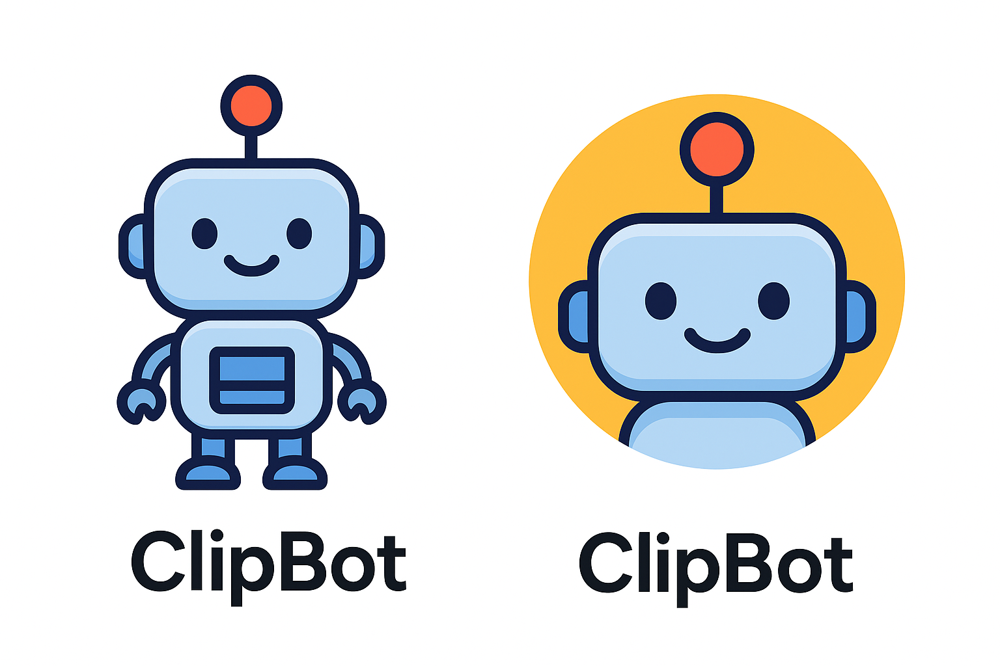

📎 ClipBot

A customizable, personality-filled chatbot with moods, memory, GUI launcher, and update system.

⭐ Features

ClipBot is not just a chatbot — it’s a mini virtual friend with emotions, history, and personality.

🧠 Memory

Remembers facts (not personal info).

Stores messages & moods in JSON files.

Can get mad, calm down, or become friendly again.

🎭 Personality

Friendly, funny, curious modes

Sarcastic mode while upset

Shy mode

Auto-forgiveness points

Changes speech depending on mood

⏱ Absence Detection

ClipBot reacts if you return after:

1 day — misses you

3+ days — gets worried or grumpy

7+ days — dramatic 😉

🖥 Linux GUI Launcher

Includes a Zenity-powered desktop launcher:

Run ClipBot

Zip project folder

Edit settings

Check for updates

Auto-logs

🌐 Online Update Checker

ClipBot compares your local version to the latest one online:
